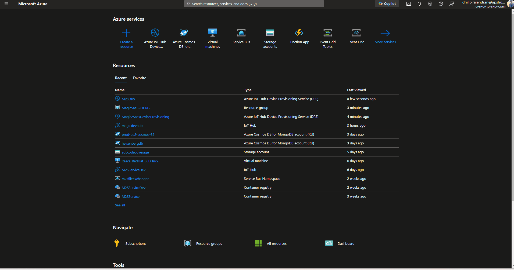
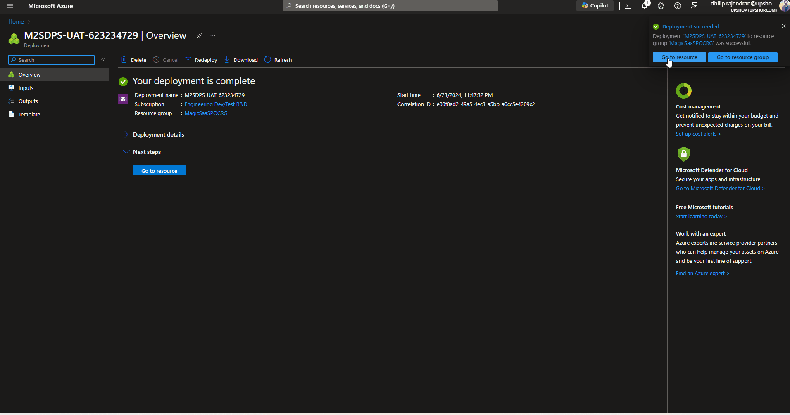
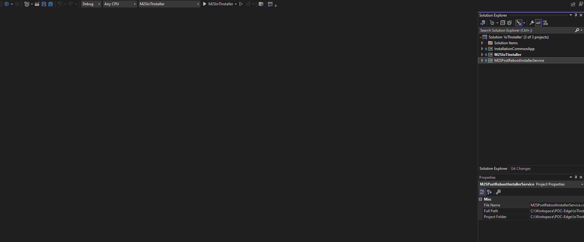
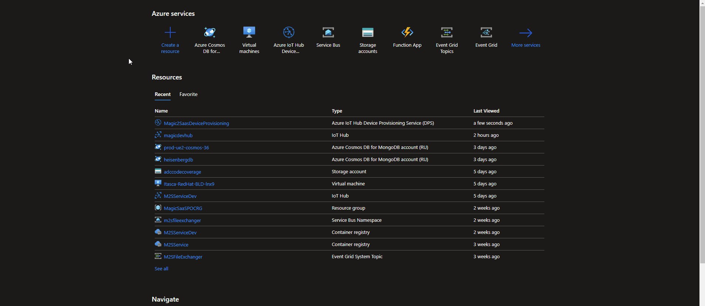
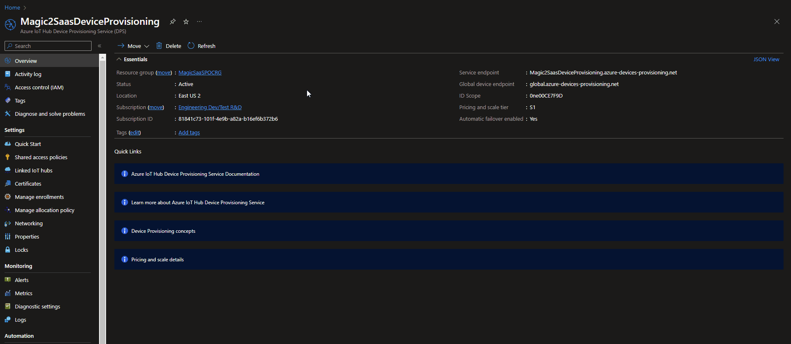
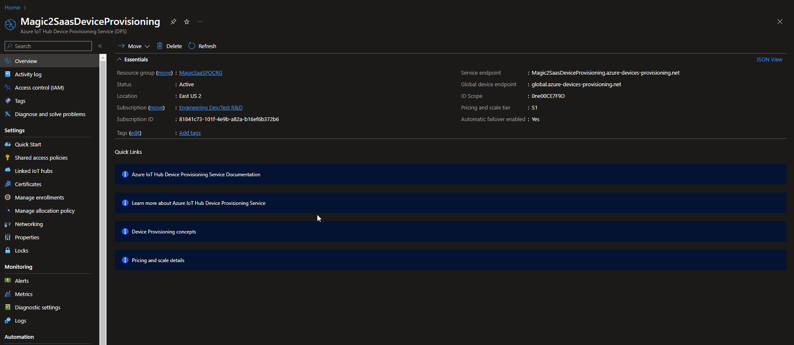

# IoT Device Installer

## Overview
The IoT Device Installer is a comprehensive solution designed to install and provision IoT Edge devices using Azure IoT Hub and Device Provisioning Service (DPS). This project ensures seamless installation of IoT Edge runtime, registration, and provisioning of devices, including post-reboot tasks.

## Project Structure
- **IoTEdgeInstaller**: Main project responsible for checking and enabling Hyper-V, and creating scheduled tasks for post-reboot installation.
- **InstallationCommonApp**: Common application that handles the core installation process, including downloading and installing the IoT Edge runtime and provisioning the device.
- **PostRebootInstallerService**: A service or task that continues the installation process after a system reboot if required.

## Features
- **Hyper-V Check and Enable**: Ensures Hyper-V is enabled on the machine.
- **IoT Edge Runtime Installation**: Downloads and installs the Azure IoT Edge runtime.
- **Device Registration and Provisioning**: Registers and provisions the device using Azure DPS.
- **Post-Reboot Installation**: Handles tasks that need to be executed after a system reboot.
- **Task Scheduler Integration**: Creates a scheduled task to continue the installation process after a reboot.
- **Detailed Logging**: Logs all steps of the installation process for troubleshooting.

## Getting Started

### Prerequisites
- Windows operating system with administrator privileges.
- .NET 8.0 SDK installed.
- Azure IoT Hub and Device Provisioning Service setup.
- Visual Studio 2022 or later.

### Installation Steps
1. **Clone the Repository**
    ```bash
    git clone https://applieddatacorp@dev.azure.com/applieddatacorp/Upshop/_git/POC-Edge
    cd IoTInstaller/IoTDeviceInstaller
    ```

2. **Build the Solution**
    Open the solution in Visual Studio and build the project.

3. **Publish the Installer**
    - **InstallationCommonApp**
      - Right-click on the `InstallationCommonApp` project and select `Publish`.
      - Choose the publishing method as "Folder" and configure the settings as needed.
      - Publish the project to generate the necessary files. Once the publish succeeds, it will also copy the files under `IoTEdgeInstaller/InstallationCommonApp`.
    - **PostRebootInstallerService**
      - Right-click on the `PostRebootInstallerService` project and select `Publish`.
      - Choose the publishing method as "Folder" and configure the settings as needed.
      - Publish the project to generate the necessary files. Once the publish succeeds, it will also copy the files under `IoTEdgeInstaller/PostRebootInstallerService`.
    - **IoTEdgeInstaller**
      - Right-click on the `IoTEdgeInstaller` project and select `Publish`.
      - Choose the publishing method as "Click Once" and configure the settings as needed.
      - Publish the project to generate the installer which contains ("Application Files" folder, "IoTEdgeInstaller.application" file, and "setup.exe" file).

### Usage
1. **Run the Installer**
    - Execute the generated installer (`setup.exe`).
    - Follow the prompts to complete the installation.

2. **Provide the Device Name**
    - During the installation, you will be prompted to enter the device name.
    - The device name will be used to generate a unique device registration ID.

3. **Check Hyper-V Status**
    - The installer checks if Hyper-V is enabled. If not, it will enable Hyper-V and prompt for a system restart.
    - After restarting, the scheduled task will continue the installation process.

4. **Installation and Provisioning**
    - The installer downloads and installs the IoT Edge runtime.
    - The device is registered and provisioned using Azure DPS.
    - Upon successful installation, a success HTML file is created and opened in the default web browser.

### Configuring Azure IoT Hub and Device Provisioning Service (DPS)

1. **Set Up Azure IoT Hub**
    - Navigate to the Azure portal.
    - Click on `Create a resource` and select `IoT Hub`.
    - Fill in the required details and create the IoT Hub.
    - Once created, navigate to the IoT Hub and note the `IoT Hub Connection String`.

2. **Set Up Device Provisioning Service (DPS)**
    - Navigate to the Azure portal.
    - Click on `Create a resource` and select `IoT Hub Device Provisioning Service`.
    - Fill in the required details and create the DPS instance.
    - Link the DPS instance to your IoT Hub:
      - Navigate to your DPS instance.
      - Under `Linked IoT hubs`, click `Add` and select your IoT Hub.
      - Note the `ID Scope` value from the overview page of the DPS instance.
   

3. **Create an Enrollment Group in DPS**
    - Navigate to your DPS instance in the Azure portal.
    - Under `Manage enrollments`, click on `Enrollment groups`.
    - Click on `Add enrollment group`.
    - Fill in the required details, such as `Group name`, and select `Symmetric Key` as the `Attestation type`.
    - Save the enrollment group and note the `Primary Key` and `Secondary Key`.
    

4. **Update Device Provisioning Service (DPS) Details in Code**
    In case we want to update the Device Provisioning Service (DPS) for a different client, follow the below steps:
    - Go to `InstallationCommonApp -> Program.cs` -> Change the DPS config values.
    

    - **dpsScopeId** - ID Scope value from Azure IoT Hub Device Provisioning Service (DPS).
    
    
    - **primaryKey** - Primary Symmetric Key value from Enrollment Group of DPS.
    
    
    - **secondaryKey** - Secondary Symmetric Key value from Enrollment Group of DPS.
    
    

### Post-Installation
To check the installation status and other details, open a PowerShell window with administrator access and execute the following command:

```powershell
Connect-EflowVm
```

Once logged into the EFLOW VM, execute the below sudo commands to check the status and modules:

```sh
sudo iotedge list
sudo iotedge system logs
```


### Logging
All installation steps are logged to `installation.log` under the respective executable's folder located in the installation directory. This file can be used for troubleshooting and verifying the installation process.

## Contributing
Contributions are welcome! Please follow these steps to contribute:

1. Fork the repository.
2. Create a new branch.
3. Make your changes.
4. Submit a pull request.

## Contact
For any questions or issues, please reach out to the POD7 Team.


Thank you for using the IoT Device Installer!